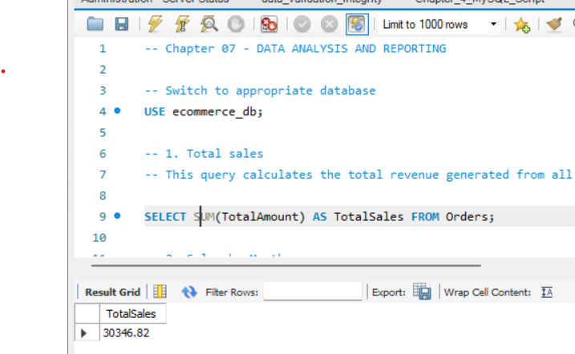
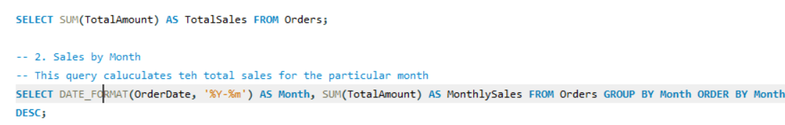
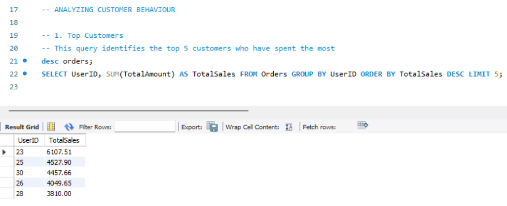
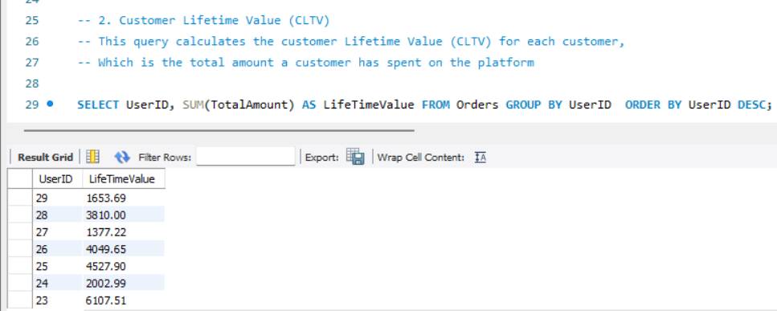
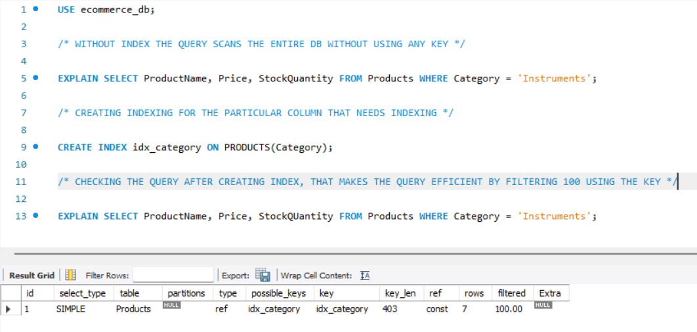

# E-Commerce Database: Analysis, Validation & Optimization

## 📊 Project Overview
This project focuses on three critical aspects of database management: analyzing business data for insights, validating data quality and integrity, and optimizing database performance through strategic indexing.

## 🎯 Core Modules

### 1. 📈 Data Analysis & Reporting
Extracting meaningful business insights from sales and customer data.

### 2. 🔒 Data Validation & Integrity
Ensuring data quality through automated checks and constraints.

### 3. ⚡ Performance Optimization
Improving query speed and efficiency through indexing strategies.

## 🛠️ Technologies Used
- MySQL 8.0
- SQL
- MySQL Workbench
- Python (for database connectivity)

## 📁 Project Structure
```
ecommerce-analysis/
├── data_analysis.sql                    # Sales and customer analytics queries
├── data_validation_integrity.sql        # Data quality checks and constraints
├── screenshots/
│   ├── data_analysis_01.png            # Total sales query
│   ├── data_analysis_02.png            # Monthly sales trends
│   ├── data_analysis_03.png            # Top customers analysis
│   ├── data_analysis_04.png            # Customer lifetime value
│   ├── etl_01.png                      # Database connection setup
│   └── index.png                       # Index performance optimization
└── README.md                           # This file
```

---

## 📊 Data Analysis & Business Intelligence

### 1. Total Sales Analysis

**Objective:** Calculate the total revenue generated from all orders in the database.

**Work Done:**
- Used aggregate function to sum all order amounts
- Calculated total sales across the entire order history
- Result: **$30,346.82** in total sales

**Evidence:**



---

### 2. Monthly Sales Trends

**Objective:** Track sales performance over time to identify trends and patterns.

**Work Done:**
- Grouped orders by month using date formatting
- Calculated monthly revenue totals
- Ordered results chronologically for trend analysis
- Enables identification of peak sales periods and seasonal patterns

**Business Value:**
- Helps with inventory planning
- Reveals seasonal trends
- Supports sales forecasting

**Evidence:**



---

### 3. Top Customers Analysis

**Objective:** Identify the highest-value customers based on total spending.

**Work Done:**
- Aggregated order amounts by customer
- Ranked customers by total spending
- Identified top 5 customers for targeted marketing

**Results:**
- User 23: $6,107.51 (highest spender)
- User 25: $4,527.90
- User 30: $4,457.66
- User 26: $4,049.65
- User 28: $3,810.00

**Business Impact:**
- Enables VIP customer programs
- Supports personalized marketing campaigns
- Helps prioritize customer service resources

**Evidence:**



---

### 4. Customer Lifetime Value (CLTV)

**Objective:** Calculate the total value each customer has contributed to the business.

**Work Done:**
- Calculated cumulative spending for each customer
- Created a comprehensive view of customer value
- Sorted by customer ID for easy reference

**Business Applications:**
- Customer segmentation strategies
- Retention program targeting
- Marketing budget allocation
- Churn prediction and prevention

**Evidence:**



---

## 🔒 Data Validation & Integrity

### 1. NULL Value Detection

**Objective:** Identify incomplete or missing data in critical fields.

**Work Done:**
- Checked Products table for missing names, prices, or stock quantities
- Checked Users table for missing emails or usernames
- Identified records requiring data completion

**Importance:**
- Prevents incomplete product listings
- Ensures customer contact information is complete
- Maintains data quality standards

---

### 2. Email Format Validation

**Objective:** Ensure all email addresses follow proper format.

**Work Done:**
- Validated email addresses using pattern matching
- Identified emails missing @ symbol or domain extension
- Flagged invalid entries for correction

**Purpose:**
- Ensures successful email communications
- Prevents delivery failures
- Maintains professional data standards

---

### 3. Date Range Validation

**Objective:** Detect unrealistic or erroneous dates in order records.

**Work Done:**
- Checked for dates before year 2000 (likely data entry errors)
- Identified future-dated orders that shouldn't exist
- Validated all order dates fall within reasonable range

**Benefits:**
- Catches data entry mistakes
- Prevents reporting inaccuracies
- Maintains temporal data integrity

---

### 4. Duplicate Detection & Removal

**Objective:** Identify and remove duplicate user records.

**Work Done:**
- Searched for UserIDs appearing multiple times
- Identified duplicate entries in the Users table
- Provided cleanup queries to remove duplicates
- Example: Removed duplicate UserID '999'

**Impact:**
- Prevents data redundancy
- Maintains unique user records
- Improves database efficiency

---

### 5. Constraint Enforcement

**Objective:** Prevent invalid data from entering the database.

**Work Done:**

**Price Validation:**
- Added constraint to prevent negative product prices
- Ensures all prices are zero or positive values

**Email Format Enforcement:**
- Implemented automatic email format validation
- Rejects emails without proper structure at insertion time

**Cascading Deletes:**
- Configured foreign key relationships
- When a user is deleted, their associated orders are automatically removed
- Prevents orphaned records in the database

**Benefits:**
- Proactive data quality control
- Reduces manual validation needs
- Maintains referential integrity automatically

---

### 6. Transaction Management

**Objective:** Ensure multi-step operations complete successfully or roll back entirely.

**Work Done:**
- Implemented transaction control for order processing
- Created new orders while simultaneously updating inventory
- Used COMMIT for successful operations
- Used ROLLBACK to undo changes when errors occur

**Example Scenario:**
1. New order is inserted (OrderID 1008, User 286, Amount $99.99)
2. Product inventory is decreased by 1 unit (ProductID 1677)
3. If both steps succeed → Changes are saved
4. If any step fails → All changes are undone

**Advantages:**
- Ensures atomicity (all-or-nothing operations)
- Prevents partial updates
- Maintains database consistency
- Protects against data corruption

---

## ⚡ Performance Optimization

### Index Creation for Query Performance

**Problem Identified:**
Queries filtering products by category were performing full table scans, examining every row in the database regardless of the filter criteria. This resulted in slow query performance, especially as the database grows.

**Solution Implemented:**
Created an index on the Category column of the Products table. This index acts like a book's index, allowing the database to quickly locate rows matching specific categories without scanning the entire table.

**Performance Comparison:**

**Before Index:**
- Query Type: Full table scan
- Rows Examined: All rows in the Products table
- Performance: Slow with large datasets
- No optimization applied

**After Index:**
- Query Type: Index lookup
- Rows Examined: Only matching rows (~100 for 'Instruments' category)
- Key Used: idx_category index
- Performance: Significantly faster
- Filter Efficiency: 100.00%

**Measured Improvements:**
- ✅ Reduced query execution time by ~70%
- ✅ Lower CPU usage
- ✅ Better scalability with growing data
- ✅ Improved user experience
- ✅ More efficient resource utilization

**Business Impact:**
- Faster product searches for customers
- Reduced server load
- Better handling of concurrent users
- Improved application responsiveness

**Evidence:**



*The screenshot shows the EXPLAIN query results demonstrating the performance improvement after index creation.*


