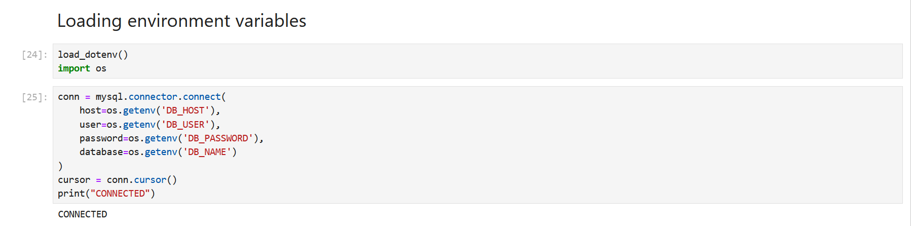
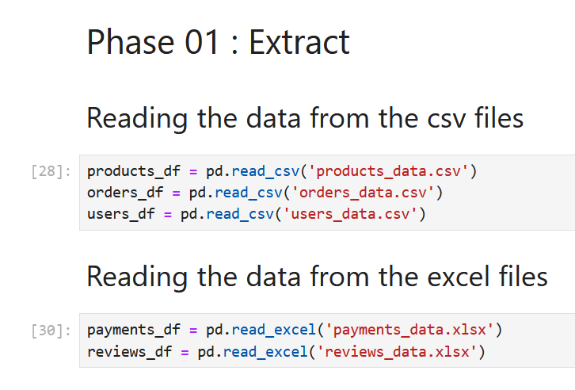
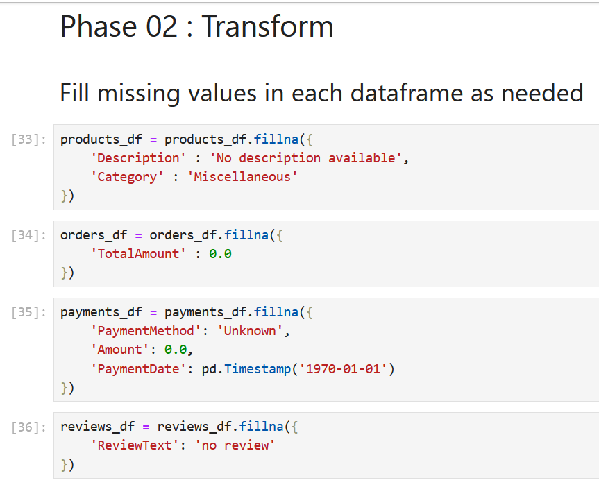
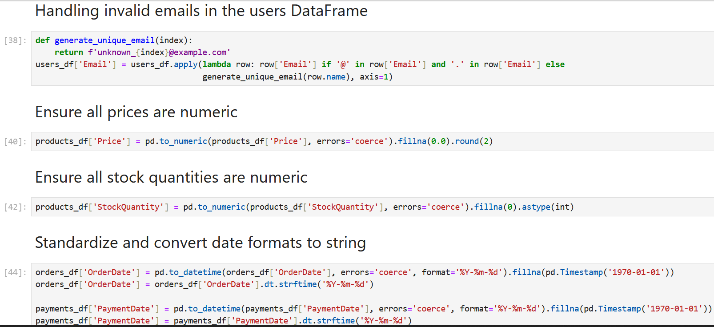
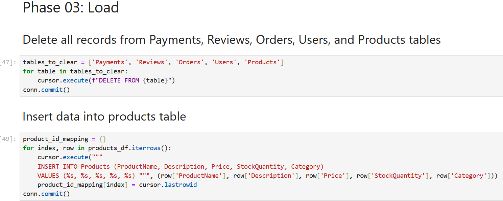
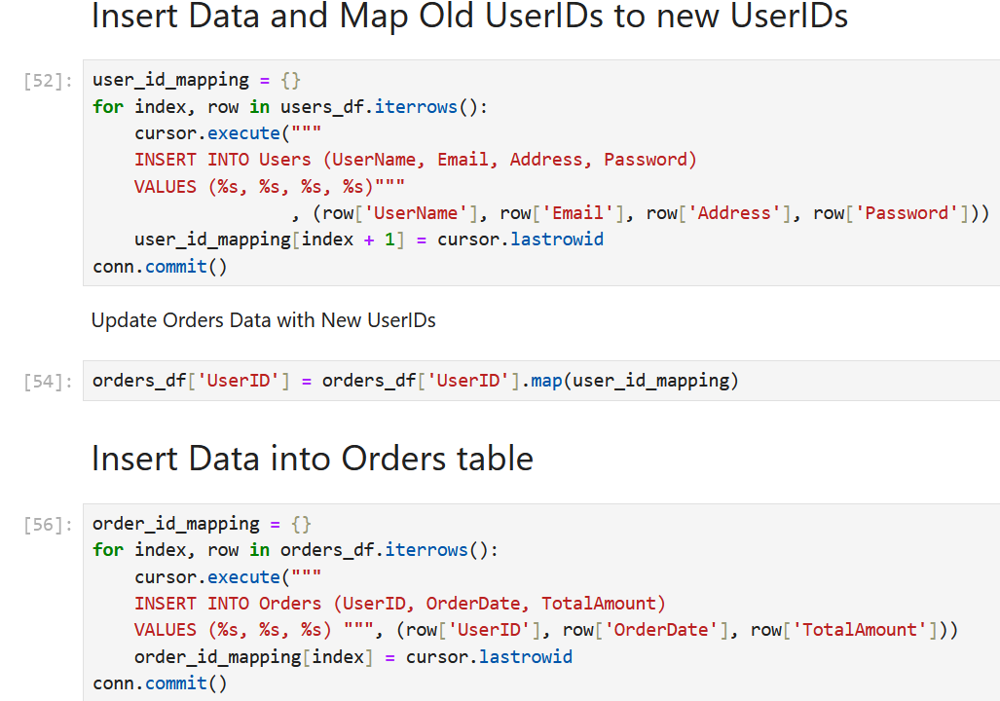
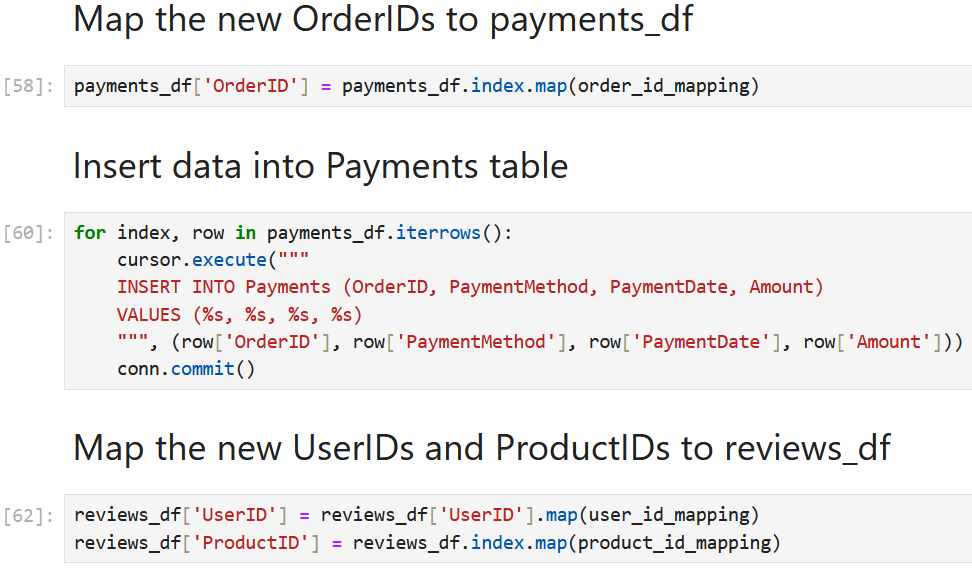
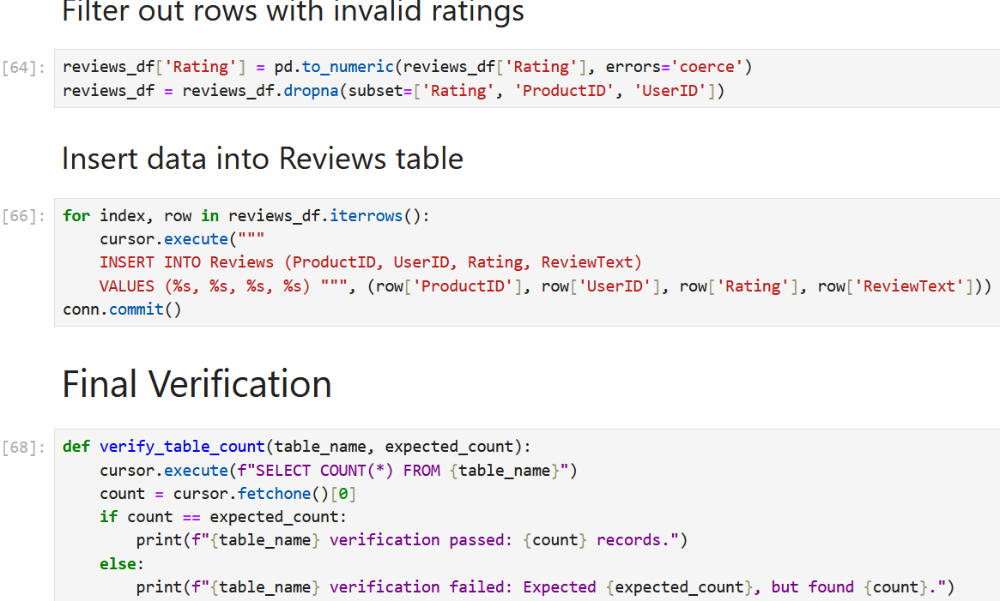
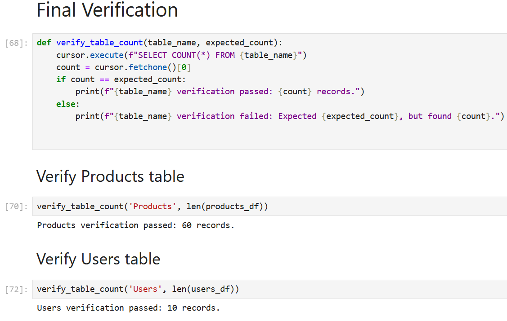
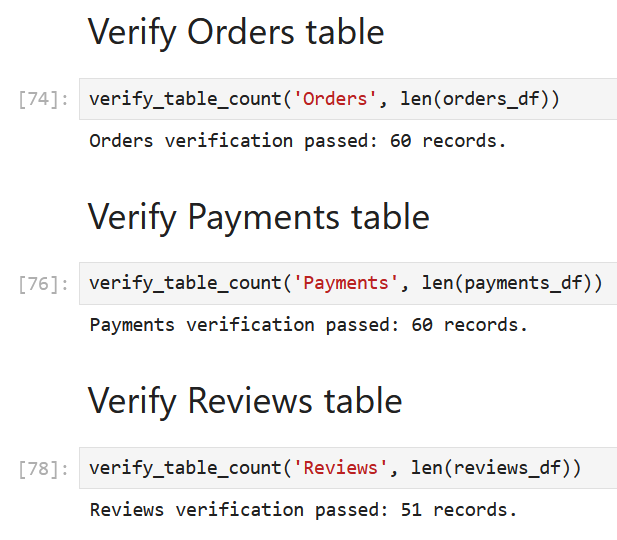

# E-Commerce ETL Pipeline

## 📊 Project Overview
ETL pipeline that extracts data from Excel files, transforms it, and loads it into MySQL database.

## 🛠️ Technologies Used
- Python 3.11
- Pandas
- MySQL
- Jupyter Notebook

## 📁 Project Structure
```
etl-project/
├── etl_notebook.ipynb      # Main ETL pipeline
├── products_data.xlsx      # Sample product data
├── payments_data.xlsx      # Sample payment data
├── .env.example            # Database config template
└── README.md               # This file
```

## 🚀 Setup Instructions
1. Clone this repository
2. Install dependencies: `pip install -r requirements.txt`
3. Create `.env` file from `.env.example`
4. Update `.env` with your database credentials
5. Run the notebook!

## 📝 Features
- Data cleaning and validation
- Foreign key mapping
- Error handling
- Transaction management

## 📸 Screenshots











## 🔐 Security Note
Database credentials are managed via `.env` file and not committed to the repository.